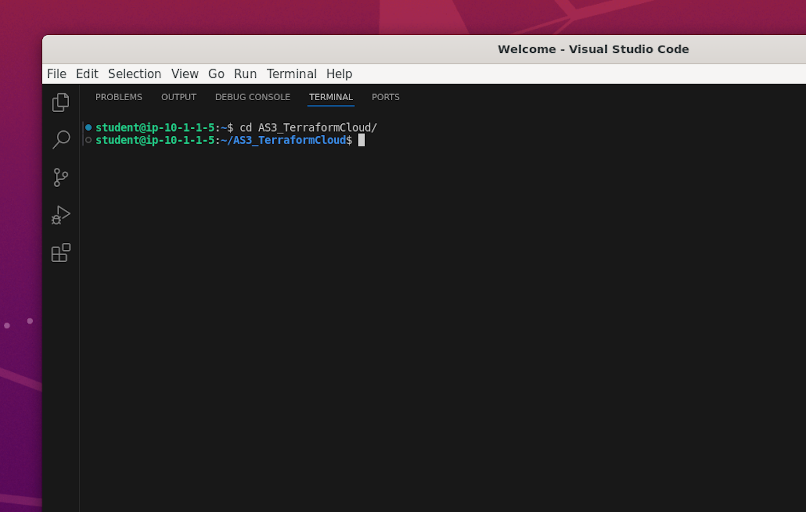
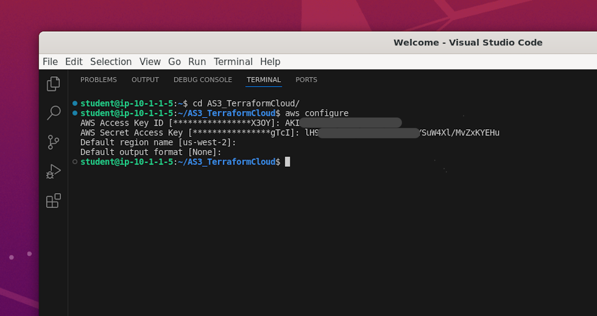

# Exercise 1.1 - Explore UDF and access AWS environment.
=======================================================
1. Prior to this workshop, student must have received an email with your login instructions and a link to access the UDF course.
   We need this to access and deploy  infrastructure on AWS for this lab. 

   
   
   **Note:** If you are not able to find these details please ask instructor.
   
2. On clicking the link, you will enter the course lobby as shown below. Verify the course name (Dynamic Service Networking) and click Join.

   
   
3. Click on DEPLOYMENT buttom on the top left to begin provisioning your personal lab access server and network in AWS.
   Here we are creating a ubuntu server to access to AWS resources

   

4. Ensure the 'Region' is ``` us-west-2 ```
   Currently the lab is only design for AWS resources in us-west-2

   
5. Navigate to Componets -->  Systems Jumpbox --> Access --> RDP and RDP into the JumpBox

   
   
    
6. Upon entering the RDP session on the Ubuntu jumpbox, locate "Activities" positioned in the top-left     corner and proceed to click on it to view the available applications.

   

   Click on the Vscode icon as shown below

   

   change directory to ```cd AS3_TerraformCloud```

   

7. On the browser, under the deployment tab, click on **Cloud Accounts** and look for the **API Key** and **API Secret** as shown below
   We will be using these AWS Secret Keys to authenticate the AWS Cloud to create infrastructure.

  
8. In the terminal, execute the command "aws configure" and input both the AWS key and AWS secret when prompted.

   

```
 aws configure

    AWS Access Key ID [****************CGGT]:XXXXXXXXXXXXX

    AWS Secret Access Key [****************QmTY]:XXXXXXXXXXX
```

  **Note:**  Let region be default us-west-2

You now have access to your AWS environment. We are now ready to deploy and configure our infrastructure. Go to [Exercise1.2](../Exercise1.2) to subscribe to a trial versiono of F5 BIG-IP from AWS marketplace. 


[GoTo Next Exercise1.2](../1.2/README.md)

[GoBack](../README.md)
