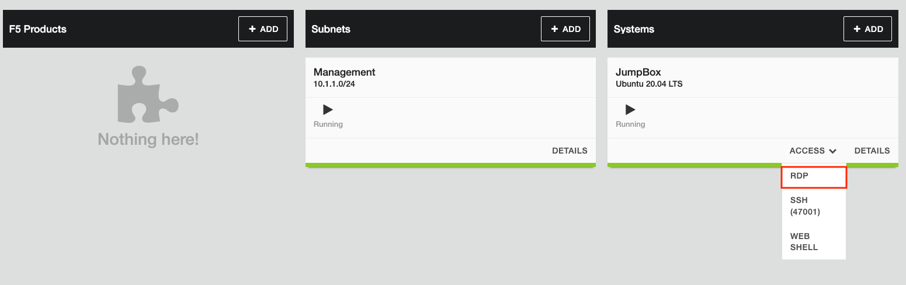
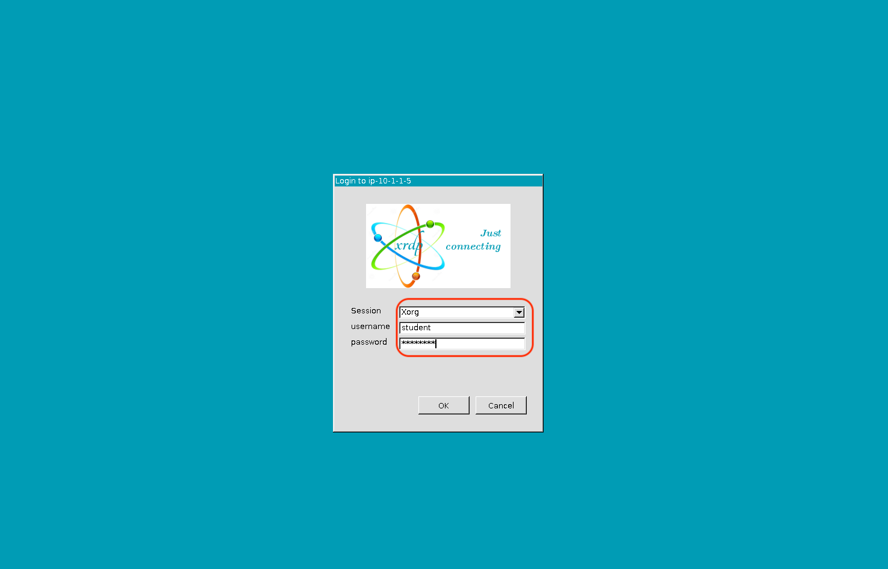
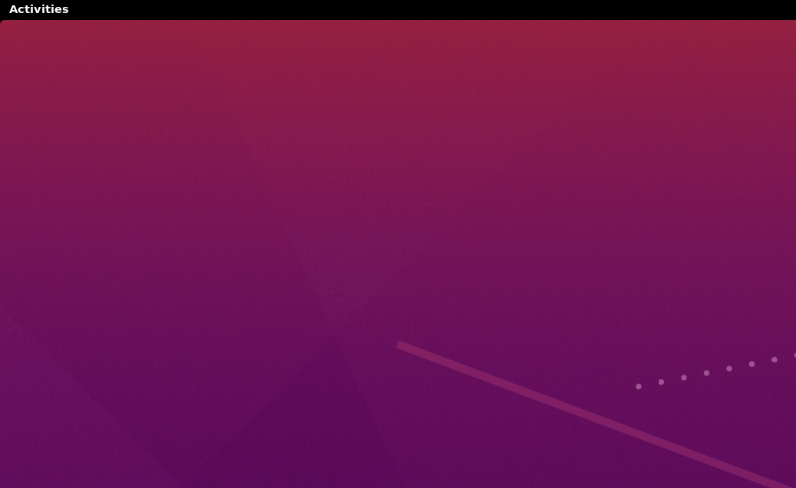
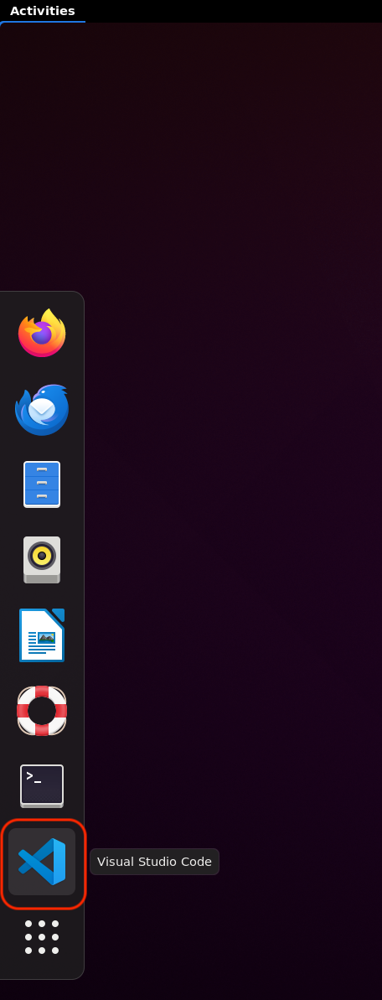
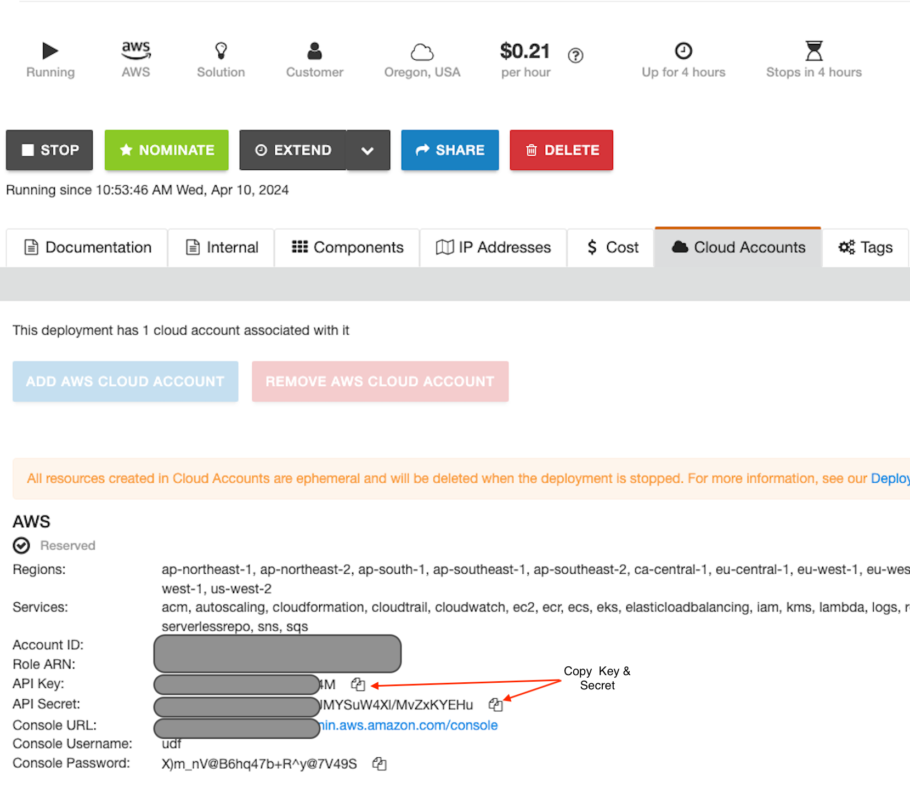

# Exercise 1.1 - Explore UDF and access AWS Environment.


1. Prior to this workshop, student must have received an email with your login instructions and a link to access the UDF course. We need this to access and deploy  infrastructure on AWS for this lab. 

  

   
   **Note:** If you are not able to find these details please ask the instructor.
   
2. On clicking the link, you will enter the course lobby as shown below. Verify the course name  and click Join.

   

   
3. Click the __DEPLOYMENT__ button on the top left to begin provisioning your personal lab access server and network in AWS. Here we are creating an Ubuntu server to access  AWS resources

   


4. Ensure the 'Region' is ``` us-west-2 ```
   Currently, the lab is only designed for AWS resources in the us-west-2

   
5. Navigate to Components -->  __Systems Jumpbox__ --> __Access__ --> __RDP__ and RDP into the JumpBox



   
  You'll be presented with a range of resolution options. Feel free to choose whichever suits your 
  needs. If you don't make a selection, it will automatically default to the highest resolution
  Please use username as ```student``` and password as ```workshop```
  
   
    
6. Upon entering the RDP session on the Ubuntu jump box, locate "__Activities__" positioned in the top- 
left corner and proceed to click on it to view the available applications.



  Locate the VScode icon and click on it. Similarly, locate the browser icon and click on it. Both 
  applications will then launch. Please allow a few seconds for them to appear, especially since 
  you're using RDP
  
   

   change directory to
   ```
   cd BIG-IP-Configs-to-AS3-with-Terraform

   ```
   We're navigating to the directory to ensure we're in the right location to begin interacting 
   with HCP Terraform for deploying the Org and workspace later

   


7. On the browser, under the deployment tab, click on **Cloud Accounts** and look for the **API Key** and **API Secret** as shown below
We will be using these AWS Secret Keys to authenticate the AWS Cloud to create infrastructure.

  

   We'll require this information to input as AWS credentials into HCP Terraform, as all tasks will 
   be executed through HCP Terraform.

[GoTo Next Exercise1.2 Create a New Organisation and Workspace on HCP Terraform](ex2.md)

[GoBack](../README.md)
