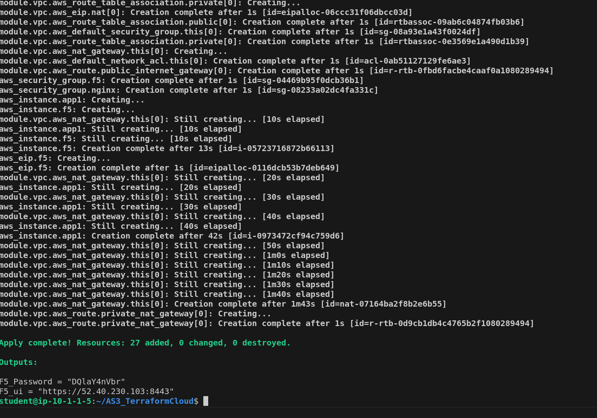
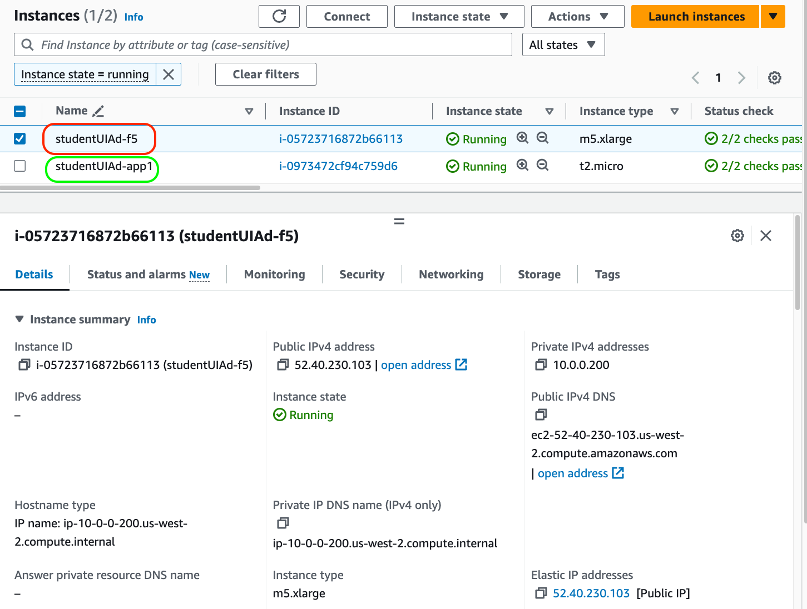

Exercise 3- Day 0 BIG-IP Deployment on AWS
==========================================

We will be using Terraform to deploy BIG-IP instance on AWS in a VPC, It uses AWS 

The following topics will be covered

## Execute Terraform init
```
terraform init
```


## Execute Terraform plan
```
terraform plan
```


## Configure VariableSets for AWS Credentials on Terraform Cloud


## Execute Terraform apply
```
terraform apply -auto-approve
```



## Check EC2 deployed on AWS Dashboard


